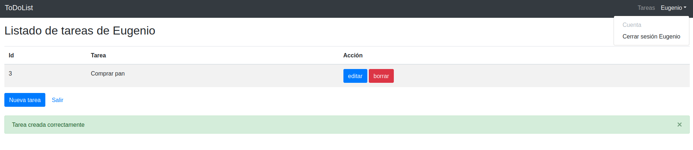
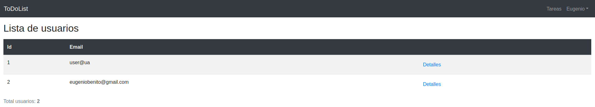
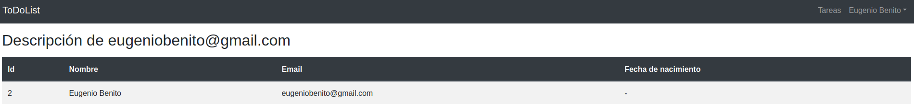

# ToDoLit 1.1.0

Esta nueva versión de la aplicación incorpora **5 nuevas _features_**:

* [Barra de menú](#barra-de-menú) 
* [Página de listado de usuarios](#listado-de-usuarios) 
* [Página de descripción de un usuario](#descripción-de-usuario) 
* [Usuario administrador](#usuario-administrador) 
* [Protección listado y descripción de usuario](#protección-de-listado-de-usuario-y-descripción-de-usuario) 

<a name="navbar"></a>
## Barra de menú
Se implementa mediante un componente [Navbar](https://getbootstrap.com/docs/4.0/components/navbar/) de Bootstrap. Puedes consultar los detalles del funcionamiento en la [tarjeta](https://trello.com/c/ldKXKcoG/2-002-barra-de-men%C3%BA) Trello de la funcionalidad.

La barra de navegación es un [fragmento Thymeleaf](https://github.com/mads-ua-22-23/mads-todolist-eugeniobenito/commit/d65d1ee54d00a86be554b34ae8552150f3a45d94) que se inserta en todas las páginas (a excepción de las de _login_ y _registro_).

Para modificar sus características en función de si una página se visita por un usuario logeado o no logeado, comprobamos si el atributo `usuario` es nulo o no.

```html
           <ul th:if="${usuario == null}" class="navbar-nav ml-auto">
                <li class="nav-item">
                    <a class="nav-link" href="/login">Login</a>
                </li>
                <li class="nav-item">
                    <a class="nav-link" href="/registro">Registro</a>
                </li>
            </ul>
```
El objeto `usuario` es insertado por en el HTML por los controladores de las páginas correspondientes y proporcionado por el servicio `usuarioService.findById()`. 

Por ejemplo:

```java
@GetMapping("/about") 
    public String about(Model model, HttpSession session) {
        Long idUsuarioLogeado = managerUserSession.usuarioLogeado();

        Usuario usuario = (idUsuarioLogeado != null) ? usuarioService.findById(idUsuarioLogeado)
                : null;
        model.addAttribute("usuario", usuario);
        return "about";
    }
```

De este modo, en caso de no serlo podemos aprovechar los datos del usuario logeado para mostrar su nombre como una opción en el menú.


<figcaption>Página de Tareas</figcaption>
<br>

Puedes consultar la implementación de esta funcionalidad más en detalle [aquí](https://github.com/mads-ua-22-23/mads-todolist-eugeniobenito/issues?q=label%3A%22002+Barra+de+men%C3%BA%22+is%3Aclosed).

<a name="user_list"></a>
## Listado de usuarios

Mediante la petición

```
GET /registrados 
```

Se obtiene un listado de usuarios registrados. Para más información de la funcionalidad puedes consultar su [tarjeta](https://trello.com/c/5oyMUvaR/3-003-p%C3%A1gina-lista-de-usuarios) Trello.

### Servicio


Se implementó el método 
```java 
public Iterable<Usuario> allUsuarios()
```

Que símplemente retorna el objeto devuelto por la clase `usuarioRepository.findAll()` que contiene todos los usuarios registrados en el sistema.

### Controller 
Se ha añadido la clase [UsuarioController.java](https://github.com/mads-ua-22-23/mads-todolist-eugeniobenito/blob/main/src/main/java/madstodolist/controller/UsuarioController.java) para gestionar las peticiones HTTP referentes a la gestión de usuarios. 

> Posteriormente veremos que estas acciones serán accesibles solo por el administrador.

```java
@Controller
public class UsuarioController {

    @Autowired
    UsuarioService usuarioService;

    @GetMapping("/registrados")
    public String listadoUsuarios(Model model, HttpSession session) {
        model.addAttribute("usuarios", usuarioService.allUsuarios());
        return "listaUsuarios";
    }

}
```

### Vista
También se ha añadido la vista [listaUsuarios.html](https://github.com/mads-ua-22-23/mads-todolist-eugeniobenito/blob/main/src/main/resources/templates/listaUsuarios.html)


<figcaption>Listado de usuarios</figcaption>
<br>

Puedes consultar la implementación de esta funcionalidad más en detalle [aquí](https://github.com/mads-ua-22-23/mads-todolist-eugeniobenito/issues?q=label%3A%22003+P%C3%A1gina+listado+de+usuarios%22+is%3Aclosed).

<a name="user_description"></a>
## Descripción de usuario

Mediante la petición

```
GET /registrados/{id}
```

se obtiene una vista con los detalles del usuario indicado. Para más información de la funcionalidad puedes consultar su [tarjeta](https://trello.com/c/1QSIPLll/4-004-p%C3%A1gina-descripci%C3%B3n-de-usuario) Trello.

### Controller

Se ha añadido el método 

```java
 @GetMapping("/registrados/{id}")
    public String detallesUsuario(@PathVariable(value = "id") Long idUsiario,Model model, HttpSession session) {
        Usuario usuario = usuarioService.findById(idUsiario);
        model.addAttribute("user", usuario);
        return "detalleUsuario";
    }
```

a la clase [UsuarioController.java](https://github.com/mads-ua-22-23/mads-todolist-eugeniobenito/blob/main/src/main/java/madstodolist/controller/UsuarioController.java) para retornar los la vista correspondiente con el objeto `usuario` con la información del usuario solicitado mediante el parámetro de de la URL


### Vista
También se añadió la vista [detalleUsuario.html](https://github.com/mads-ua-22-23/mads-todolist-eugeniobenito/blob/main/src/main/resources/templates/detalleUsuario.html)


<figcaption>Descripción de usuario</figcaption>
<br>

### Test
En [UsuarioWebTest.java](https://github.com/mads-ua-22-23/mads-todolist-eugeniobenito/blob/main/src/test/java/madstodolist/UsuarioWebTest.java) mockeamos el servicio `userService.findByID()` para que nos devuelva un usuario con características predefinidas.

Posteriormente se comprueba que la información del usuario aparezca en la vista HTML.
```java
        @Test
        public void servicioDescripciónUsuario() throws Exception {

                // GIVEN
                // Un usuario con correo y Id
                Usuario usuario = new Usuario("user@ua");
                usuario.setNombre("Usuario Ejemplo");
                usuario.setId(1L);

                // WHEN
                // Mockeamos el servicio de búsqueda por Id para que nos devuelva el 
                // usuario que acabamos de crear
                when(usuarioService.findById(usuario.getId())).thenReturn(usuario);

                // THEN
                // Se realiza la petición GET a la descipción del usuario,
                // el HTML devuelto contiene la información de nuestro usuario
                this.mockMvc.perform(get("/registrados/1"))
                .andExpect((content().string(allOf(
                                containsString("Descripción de user@ua"),
                                containsString("Id"),
                                containsString("Nombre"),
                                containsString("Email"),
                                containsString("Fecha de nacimiento"),
                                containsString("Usuario Ejemplo"),
                                containsString("user@ua")))));
        }
```

Puedes consultar la implementación de esta funcionalidad más en detalle [aquí](https://github.com/mads-ua-22-23/mads-todolist-eugeniobenito/issues?q=label%3A%22004+P%C3%A1gina+descripci%C3%B3n+de+usuario%22+is%3Aclosed).

<a name="user_admin"></a>
## Usuario administrador
Puedes consultar todos los detalles del funcionamiento de esta _feature_ en su [tarjeta de Trello](https://trello.com/c/HEtDWHD3/5-005-usuario-administrador).

### Modelo Usuario y UsuarioRepository

Para implementarla hemos se ha modificado el modelo [Usuario.java](https://github.com/mads-ua-22-23/mads-todolist-eugeniobenito/blob/main/src/main/java/madstodolist/model/Usuario.java) añadiendo el atributo booleano `isAdmin`. 

También se ha incluido la opción de buscar a usuarios que cuenten con ese atributo `true` en [UsuarioRepository.java](https://github.com/mads-ua-22-23/mads-todolist-eugeniobenito/blob/main/src/main/java/madstodolist/model/UsuarioRepository.java):

```java
public interface UsuarioRepository extends CrudRepository<Usuario, Long> {
    Optional<Usuario> findByEmail(String s);
    Iterable<Usuario> findByIsAdminTrue();
}
```

### Servicio
Se añade el servicio `usuarioService.findAdmin()` en [UsuarioService.java](https://github.com/mads-ua-22-23/mads-todolist-eugeniobenito/blob/main/src/main/java/madstodolist/service/UsuarioService.java) para obtener al usuario administrador o _null_ en caso de que no exista.

```java
   @Transactional(readOnly = true)
    public Usuario findAdmin() {
        Iterable<Usuario> iterable_admin = usuarioRepository.findByIsAdminTrue();
        List<Usuario> list_admin = new ArrayList<Usuario>();
        iterable_admin.forEach(list_admin::add);

        return (list_admin.isEmpty()) ? null : list_admin.get(0);
    }
```
 Nos quedamos con la primera posición de la lista que nos devuelve `Iterable<Usuario> findByIsAdminTrue()`. Posteriormente veremos comprobaciones para evitar registrar a un administrador si ya existe uno.

 Esta lógica la implementa el servicio de registro de usuarios.

```java
    @Transactional
    public Usuario registrar(Usuario usuario) {
        Optional<Usuario> usuarioBD = usuarioRepository.findByEmail(usuario.getEmail());
        if (usuarioBD.isPresent())
            throw new UsuarioServiceException("El usuario " + usuario.getEmail() + " ya está registrado");
        else if (usuario.getEmail() == null)
            throw new UsuarioServiceException("El usuario no tiene email");
        else if (usuario.getPassword() == null)
            throw new UsuarioServiceException("El usuario no tiene password");
        else if (usuario.getIsAdmin() != null && usuario.getIsAdmin() && findAdmin() != null)
            throw new UsuarioServiceException("Ya existe un administrador");
        else return usuarioRepository.save(usuario);
    }
```
En el archivo [UsuarioTestService.java](https://github.com/mads-ua-22-23/mads-todolist-eugeniobenito/blob/main/src/test/java/madstodolist/UsuarioServiceTest.java) se comprueba que la lógica de negocio funciona correctamente.

### Controller
En el método `registroForm` de [LoginController.java](https://github.com/mads-ua-22-23/mads-todolist-eugeniobenito/blob/main/src/main/java/madstodolist/controller/LoginController.java) se realiza una comprobación extra para evitar registrar un administrador erróneo:

```java
        if (registroData.getIsAdmin() && usuarioService.findAdmin() != null) {
            model.addAttribute("registroData", registroData);
            model.addAttribute("error", "Ya existe un usuario administrador");
            return "formRegistro";
        }
```

Puedes consultar la implementación de esta funcionalidad más en detalle [aquí](https://github.com/mads-ua-22-23/mads-todolist-eugeniobenito/issues?q=label%3A%22005+Usuario+administrador%22+is%3Aclosed).

<a name="protection"></a>
## Protección de listado de usuario y descripción de usuario

Puedes consultar todos los detalles del funcionamiento de esta _feature_ en su [tarjeta de Trello](https://trello.com/c/cTdrjbXr/6-006-protecci%C3%B3n-de-listado-de-usuario-y-descripci%C3%B3n-de-usuario).

### Excepción para el control de acceso
Se crea el fichero [UsuarioNoAdminException.java](https://github.com/mads-ua-22-23/mads-todolist-eugeniobenito/blob/main/src/main/java/madstodolist/controller/exception/UsuarioNoAdminException.java) que se lanzará si un usuario no administrador intenta acceder a las rutas:

```
GET /registrados 
```

```
GET /registrados/{id}
```

### Controller
En [UsuarioController.java](https://github.com/mads-ua-22-23/mads-todolist-eugeniobenito/blob/main/src/main/java/madstodolist/controller/UsuarioController.java) se crea el siguiente método:

```java
   private void comprobarUsuarioAdminYLogeado(Long idUsuario) {
        Long idUsuarioLogeado = managerUserSession.usuarioLogeado();
        Usuario admin = usuarioService.findAdmin(); 

        if (admin == null || idUsuarioLogeado == null || admin.getId() != idUsuarioLogeado) 
            throw new UsuarioNoLogeadoException();

    }
```
que utilizamos para lanzar la excepción en caso de que el usuario no tenga permiso de acceso


### Test
Se han refactorizado los test de [UsuarioWebTest.java](https://github.com/mads-ua-22-23/mads-todolist-eugeniobenito/blob/main/src/test/java/madstodolist/UsuarioWebTest.java) para mockear la obtención del usuario administrador

```java
// Mockeamos el servicio de obtención del administrador para 
// que nos devuelva al adminitrador que acabamos de crea
when(usuarioService.findAdmin()).thenReturn(admin);

// Mockeamos el método usuarioLogeado para que nos devuelva al administrador
when(managerUserSession.usuarioLogeado()).thenReturn(admin.getId());
```


Puedes consultar la implementación de esta funcionalidad más en detalle [aquí](https://github.com/mads-ua-22-23/mads-todolist-eugeniobenito/issues?q=label%3A%22006+Protecci%C3%B3n+listadoy+descripci%C3%B3n+de+usuario%22+is%3Aclosed).
