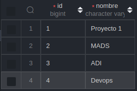
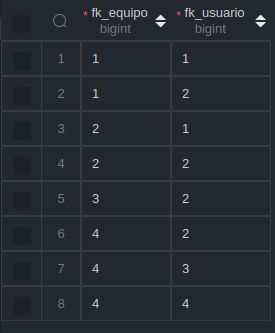
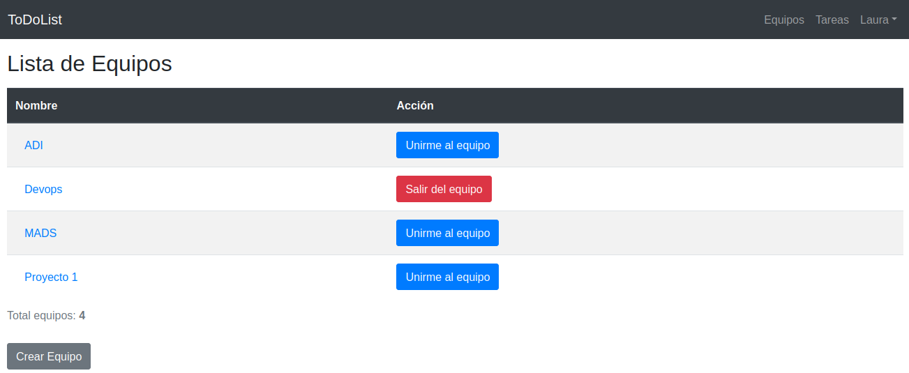
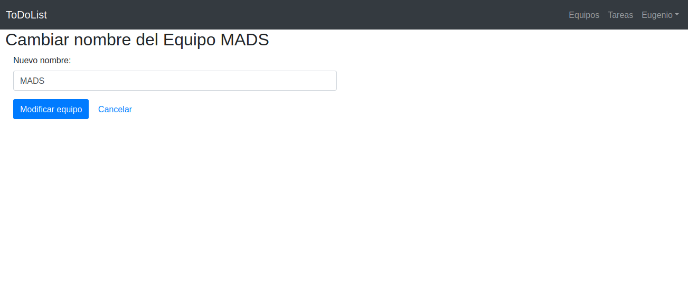

# ToDoList 1.2.0

Esta versión de la aplicación incorpora **3 nuevas _features_** 

* [Gestión de pertenencia a un equipo](#gestión-de-pertenencia-a-un-equipo) 
* [Gestión de equipos](#gestión-de-equipos) 

## Gestión de pertenencia a un equipo
Un equipo se define mediante sus atributos `id` y `nombre`. Un ejemplo de tabla sería:



<figcaption>Tabla equipos</figcaption>
<br>

La relación _Many to Many_ entre usuarios y equipos se expresa mediante la tabla **equipo_usuario**, que almacena la clave ajena del usuario y del equipo.


<figcaption>Tabla equipos_usuario</figcaption>
<br>

El siguiente método de servicio se encarga de añadir un usuario a un equipo, utilizando el método de entidad `Equipo.addUsuario(Usuario)` que actualiza ambos lados de la relación (equipos de un usuario - usuarios de un equipo).

También se encarga de realizar las comprobaciones pertinentes y lanzar las correspondientes exceptiones en caso de que tanto el usuario como el equipo no existan, o que el usuario que se intena añadir ya forme parte del equipo.

```java
@Transactional
public void addUsuarioEquipo(Long usuario_id, Long equipo_id) {
    logger.debug("Añadiendo el usuario " + usuario_id + " al equipo " + equipo_id);
    Equipo equipo = equipoRepository.findById(equipo_id).orElse(null);
    Usuario usuario = usuarioRepository.findById(usuario_id).orElse(null);
    if (equipo == null || usuario == null)
        throw new EquipoServiceException("No existe el equipo o el usuario");
    if (equipo.getUsuarios().contains(usuario))
        throw new EquipoServiceException("El usuario ya es miembro del equipo");
    equipo.addUsuario(usuario);
    equipoRepository.save(equipo);
}
```
```java
public void addUsuario(Usuario usuario) {
    this.getUsuarios().add(usuario);
    usuario.getEquipos().add(this);
}
```
Tanto los métodos de servicio y modelo como la capa _respository_ se han implementado aplicando **TDD**. Por ejemplo, el siguiente test se encarga de testear el escenario de añadir un usuario ya miembro de un equipo a dicho equipo.

```java
@Test
public void servicioAñadirUsuarioYaExistenteEnEquipo() {
    /// Un equipo creado en la base de datos y un usuario registrado
    // miembro del equipo
    Equipo equipo = equipoService.crearEquipo("Proyecto 1");
    Usuario usuario = new Usuario("user@ua");
    usuario.setPassword("123");
    usuario = usuarioService.registrar(usuario);
    equipoService.addUsuarioEquipo(usuario.getId(), equipo.getId());
    // WHEN, THEN
    // Intentamos añadir al usuario miembro se lanza excepción de
    // tipo EquipoServiceException
    Usuario usuarioBD = usuarioService.findById(usuario.getId());
    Assertions.assertThrows(EquipoServiceException.class, () -> {
        equipoService.addUsuarioEquipo(usuarioBD.getId(), equipo.getId());
    });
}
```
Comprobamos que se lance la excepción de tipo `EquipoServiceException`.

[Los métodos encargados de quitar a un usuario de un equipo siguen la misma lógica: 
- Actualizar ambos lados de la relación
- Manejo de errores en caso de usuarios o equipos no existentes
- Manejo de errores en caso de que un usuario no pertenezca a un equipo)]

Esta funcionalidad es manejada mediante el controlador `EquipoController.nuevoUsuarioEquipo()`, que responde a la petición HTTP: 

```
POST /equipos/{idEquipo}/usuarios/{idUsuario}
```

```java
@PostMapping("/equipos/{idEquipo}/usuarios/{idUsuario}")
@ResponseBody
public String nuevoUsuarioEquipo(@PathVariable(value = "idEquipo") Long equipo_id,
        @PathVariable(value = "idUsuario") Long usuario_id,
        Model model, HttpSession session) {
    Long idUsuarioLogeado = managerUserSession.usuarioLogeado();
    if (idUsuarioLogeado == null)
        throw new UsuarioNoLogeadoException();
    equipoService.addUsuarioEquipo(usuario_id, equipo_id);
    return "";
}
```

Se lanza una excepción de tipo `UsuarioNoLogeadoException` que restringe este método a usuarios no logeados.

Observamos que contamos con la etiqueta `@ResponseBody`, lo que indica que el objeto retornado es automáticamente serializado en JASON y devuelto en un objeto _HttpResponse_.

Lo usamos para no retornar una plantilla HTML y que la interacción del usuario con la funcionalidad de unirse o salirse de un equipo sea lo más dinámica posible.

La plantilla HTML `listaEquipos.html` contiene el código Javascript encargado de ralizar la petición:

```javascript
function post(url) {
    fetch(url, {
        method: 'POST'
    }).then((res) => location.reload());
}
```
El código refresca la página una vez se resuelve el _callback_. Una posible funcionalidad extra podría ser actualizar el botón de acción sin refrescar la página. 

En la vista HTML `listaEquipos.html` se encuentra el listado de equipos. La columna **Acción** contendrá un botón u otro en función de si el usuario es o no parte del equipo.

El haber implementado esta funcionalidad sin retornar nuevas vistas permite al usuario añadirse o salirse de un equipo con la facilidad de pulsar un botón.


<figcaption>Vista listado de equipos</figcaption>
<br>

Se han utilizado estructuras lógicas Thymeleaf para implementar el funcionamiento de los botones.

```html
<button th:unless="${#lists.contains(usuario.equipos, equipo)}"
    class="btn btn-primary btn-xs" onmouseover="" style="cursor: pointer;"
    th:onclick="'post(\'/equipos/'  + ${equipo.id} + '/usuarios/' + ${usuario.id}+'\');'">Unirme al equipo
</button>
```

Por ejemplo, el botón **Unirme al equipo** aparecerá cuando, entre el listado de equipos del usuario, no se encuentre el equipo de la lista `th:unless="${#lists.contains(usuario.equipos, equipo)}"`

## Gestión de equipos

La característica principal de esta funcionalidad es que **solo el usuario Administrado** tendrá la opción de cambiar el nombre de los equipos y modificarlos.

### Modificar nombre de un equipo

El modelo `Equipo` únicamente añadía el _setter_ del atributo correspondiente:

```java
public void setNombre(String nombre) {
        this.nombre = nombre;
    }
```

El método de servicio encargado de cambiar el nombre de un equipo recibe tanto el identificador del equipo como el nuevo nombre. De nuevo, se comprueba que el equipo existe y, en caso contrario, lanza la excepción `EquipoServiceException`.

Por último se actualiza el nombre en el modelo, se utiliza el método de repositorio para actualizarlo en la base de datos y se retorna el equipo actualizado.

```java
@Transactional
public Equipo modificaNombreEquipo(Long equipo_id, String nuevo_nombre) {
    logger.debug("Cambiando el nombre del equipo: " + equipo_id + " a " + nuevo_nombre);
    Equipo equipo = equipoRepository.findById(equipo_id).orElse(null);
    if (equipo == null)
        throw new EquipoServiceException("No existe el equipo");
    equipo.setNombre(nuevo_nombre);
    equipoRepository.save(equipo);
    return equipo;
}
```

Al igual que en la _feature_ anterior, las capas de servicio, modelo y repositorio se implementaron de forma incremental aplicando **TDD**. EL siguiente test comprueba que el método de servicio anterior funciona correctamente.

```java
@Test
public void testModificarNombreEquipo() {
    // GIVEN
    // Un equipo guardado en la base de datos
    Equipo equipo = equipoService.crearEquipo("Proyecto 1");
    Equipo equipoBd = equipoService.recuperarEquipo(equipo.getId());
    assertThat(equipoBd.getNombre()).isEqualTo("Proyecto 1");
    // WHEN
    // Cambiamos su nombre
    equipoService.modificaNombreEquipo(equipoBd.getId(), "Proyecto MADS");
    // THEN
    // Lo recuperamos de la base de datos y el nombre se ha modificado
    assertThat(equipoBd.getNombre()).isEqualTo("Proyecto 1");
}
```

Esta funcionalidad se implementa mediante distintos métodos de controlador que responden a distintos endpoints:

```
GET /equipos/{id}/editar
```
```java
@GetMapping("/equipos/{id}/editar")
public String formEditarNombreEquipo(@PathVariable(value = "id") Long id_equipo,
        @ModelAttribute EquipoData equipoData, Model model) {
    comprobarUsuarioAdminYLogeado(managerUserSession.usuarioLogeado());
    Equipo equipo = equipoService.recuperarEquipo(id_equipo);
    if (equipo == null)
        throw new EquipoNotFoundException();
    Usuario admin = usuarioService.findAdmin();
    model.addAttribute("equipo", equipo);
    model.addAttribute("usuario", admin);
    equipoData.setNombre(equipo.getNombre());
    return "formEditarEquipo";
}
```

Se comprueba que el equipo exista y se añaden los atributos correspondientes para construir la vista con el formulario de edición del nombre del equipo. Por último, retorna la plantilla html.

**IMPORTANTE**

Para asegurarnos que estas acciones queden restringidas al usuario **Administrador**, se implementa el siguiente método que funciona a modo de _middleware_ **comprobarUsuarioAdminYLogeado()**

```java
private void comprobarUsuarioAdminYLogeado(Long idUsuario) {
    Long idUsuarioLogeado = managerUserSession.usuarioLogeado();
    Usuario admin = usuarioService.findAdmin();
    if (admin == null || idUsuarioLogeado == null || admin.getId() != idUsuarioLogeado)
        throw new UsuarioNoLogeadoException();
}
```

En caso de no cumplir con los requisitos de estar logeado y ser el administrador, se lanzará la excepción **UsuarioNoLogeadoException()**

Veremos cómo se llama a este método desde todos los métodos del controlador relacionados con esta _feature_.

El formulario de edición se encuentra en la plantilla `formEditarEquipo.html` que crea la siguiente vista:


<figcaption>Formulario edición equipo</figcaption>
<br>

El botón **Modificar equipo** lanza la petición http para editar el nombre del equipo:

```
POST /equipos/{id}/editar
```
```java
@PostMapping("/equipos/{id}/editar")
public String grabaEquipoModificado(@PathVariable(value = "id") Long equipo_id,
        Model model, RedirectAttributes flash, @ModelAttribute EquipoData equipoData) {
    comprobarUsuarioAdminYLogeado(managerUserSession.usuarioLogeado());
    Equipo equipo = equipoService.recuperarEquipo(equipo_id);
    if (equipo == null)
        throw new EquipoNotFoundException();
    equipoService.modificaNombreEquipo(equipo_id, equipoData.getNombre());
    flash.addFlashAttribute("mensaje", "Equipo modificado correctamente");
    
    return "redirect:/equipos/" + equipo.getId();
}
```
Es controlodor incorpora la misma lógica de validación que el anterior, solo que llama al método `equipoService.modificaNombreEquipo()` para actualizar el nombre del mismo.

Incorporamos un mensaje _flash_ para devolver feedback al usuario indicándole que el equipo se actualizó correctamente.

Por úlitmo se le redirecciona al usuario a la vista usuarios del equipo que estaba modificando.

Las capas de controller y vista se testean mockeando los servicios. Se ha decidido tomar este enfoque porque, por la característica de esta _feature_ de limitar su uso al **Administrador**, nos resulta muy útil mockear al usuario logeado como administrador.

Un ejemplo de test podría ser:

```java
@Test
public void servicioModificarEquipoPost() throws Exception {
    // GIVEN
    // Un usuario con correo e ID
    Usuario usuario = new Usuario("user@ua");
    usuario.setNombre("Usuario Ejemplo");
    usuario.setId(1L);
    // Un equipo
    Equipo equipo = new Equipo("Equipo A");
    equipo.setId(1L);
    List<Equipo> listaEquipos = new ArrayList<Equipo>();
    listaEquipos.add(equipo);
    // Mockeamos el método usuarioLogeado para que nos devuelva un valor
    when(managerUserSession.usuarioLogeado()).thenReturn(usuario.getId());
    // Mockeamos el servicio de obtención del administrador para 
    // que nos devuelva al usuario que acabamos de crea
    when(usuarioService.findAdmin()).thenReturn(usuario);
    // Mockeamos el servicio de obtención de un equipo
    when(equipoService.recuperarEquipo(1L)).thenReturn(equipo);
    // Mockeamos el servicio de edición de un equipo
    when(equipoService.modificaNombreEquipo(1L, "MADS")).thenReturn(equipo);
    // WHEN, THEN
    // Realizamos una petición GET: /equipos/nuevo nos redirecciona
    // a la lista de equipos
    this.mockMvc.perform(post("/equipos/1/editar"))
            .andExpect(status().is3xxRedirection())
            .andExpect(redirectedUrl("/equipos/1"));
}
```
Podemos observar que se moquean los servicios empleados en el controller y comprueba que, tras realizar la petición _post_ se redirecciona a la vista de usuarios de un equipo.

### Eliminar un equipo
El modelo `Equipo` no requirió código adicional. Se implementó el método de servicio necesario para realizar la operación:

```java
@Transactional
public void removeEquipo(Long equipo_id) {
    logger.debug("Borrando equipo " + equipo_id);
    Equipo equipo = equipoRepository.findById(equipo_id).orElse(null);
    if (equipo == null)
        throw new EquipoServiceException("No existe el equipo");
    List<Usuario> usuarios = new ArrayList(equipo.getUsuarios());
    for (Usuario usuario : usuarios) {
        if (usuario.getEquipos().contains(equipo))
            equipo.removeUsuario(usuario);
    }
    equipoRepository.delete(equipo);
}
```

El método recupera e itera sobre los usuarios del equipo para ir eliminando de cada uno de ellos su relación con el equipo. Por último, elimina la propia entidad equipo.

Al igual que se hizo en la _feature_ anterior, debemos encargarnos de actualizar ambos lados de la relación.

El siguiente test comprueba que el método funciona correctamente:

```java
@Test
public void servicioEliminarEquipo() {
    // GIVEN
    // Un equipo guardado en la base de datos y un usuario miembro
    Equipo equipo = equipoService.crearEquipo("Proyecto 1");
    Usuario usuario = new Usuario("user@ua");
    usuario.setPassword("123");
    usuario = usuarioService.registrar(usuario);
    equipoService.addUsuarioEquipo(usuario.getId(), equipo.getId());
    // WHEN
    // Eliminamos el equipo
    Long equipo_id = equipo.getId();
    equipoService.removeEquipo(equipo_id);
    // THEN
    // El equipo no está en la base de datos ni en la lista de
    // equipos del usuarios
    assertThat(usuarioService.findById(usuario.getId()).getEquipos().isEmpty());
    Assertions.assertThrows(EquipoServiceException.class, () -> {
        equipoService.recuperarEquipo(equipo_id);
    });
}
```

Al final se comprueba que el equipo se ha eliminado correctamente (se ha lanzado la excepción **EquipoServiceException**).

El controlador de esta funcionalidad responde al endpoint:

```
DELETE /equipos/{id}
```
```java
@DeleteMapping("/equipos/{idEquipo}")
@ResponseBody
public String eliminarEquipo(@PathVariable(value = "idEquipo") Long equipo_id,
        Model model, HttpSession session) {
    comprobarUsuarioAdminYLogeado(managerUserSession.usuarioLogeado());
    Equipo equipo = equipoService.recuperarEquipo(equipo_id);
    if (equipo == null)
        throw new EquipoNotFoundException();
    equipoService.removeEquipo(equipo_id);
    return "";
}
```

Sigue una lógica similar a la del controlador encargado de eliminar o añadir al usuario a un equipo, para agilizar al máximo la experiencia del usuario.

El adiminstrador tendrá la siguiente vista:


<figcaption>Vista listado de equipos</figcaption>
<br>
